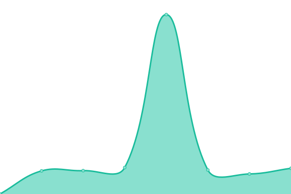
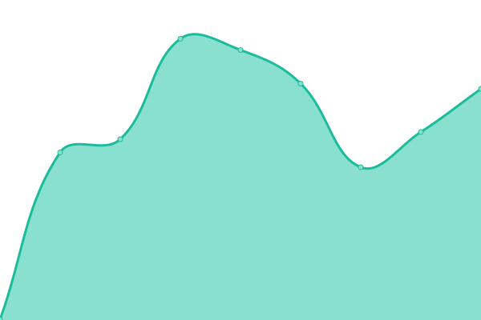
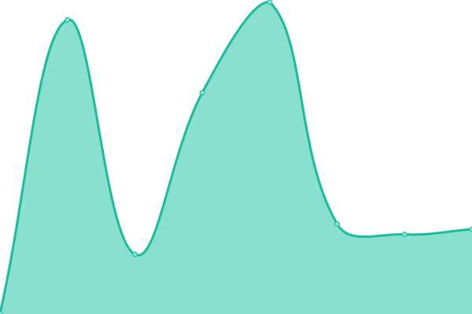
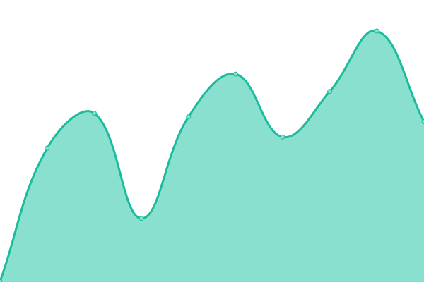
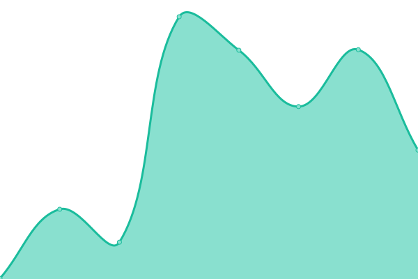

# [📈 Live Status](https://touzesabine.github.io/uppdownn): <!--live status--> **🟧 Partial outage**

This repository contains the open-source uptime monitor and status page for [Saab](https://touzesabine.github.io/uppdownn), powered by [Upptime](https://github.com/upptime/upptime).

With [Upptime](https://upptime.js.org), you can get your own unlimited and free uptime monitor and status page, powered entirely by a GitHub repository. We use [Issues](https://github.com/touzesabine/uppdownn/issues) as incident reports, [Actions](https://github.com/touzesabine/uppdownn/actions) as uptime monitors, and [Pages](https://touzesabine.github.io/uppdownn) for the status page.

<!--start: status pages-->
<!-- This summary is generated by Upptime (https://github.com/upptime/upptime) -->
<!-- Do not edit this manually, your changes will be overwritten -->
<!-- prettier-ignore -->
| URL | Status | History | Response Time | Uptime |
| --- | ------ | ------- | ------------- | ------ |
|  [City of Santa Clara](https://www.santaclaraca.gov) | 🟩 Up | [city-of-santa-clara.yml](https://github.com/touzesabine/uppdownn/commits/HEAD/history/city-of-santa-clara.yml) | 

 644ms
     
 | 

<a href="https://touzesabine.github.io/uppdownn/history/city-of-santa-clara">100.00%</a>
    

|  [Silicon Valley Animal Control Authority](https://www.svaca.com) | 🟩 Up | [silicon-valley-animal-control-authority.yml](https://github.com/touzesabine/uppdownn/commits/HEAD/history/silicon-valley-animal-control-authority.yml) | 

 1207ms
     
 | 

<a href="https://touzesabine.github.io/uppdownn/history/silicon-valley-animal-control-authority">100.00%</a>
    

|  [Silicon Valley Power](https://www.siliconvalleypower.com) | 🟩 Up | [silicon-valley-power.yml](https://github.com/touzesabine/uppdownn/commits/HEAD/history/silicon-valley-power.yml) | 

 692ms
     
 | 

<a href="https://touzesabine.github.io/uppdownn/history/silicon-valley-power">100.00%</a>
    

|  [Fiber Connect](https://www.svpfiber.com) | 🟩 Up | [fiber-connect.yml](https://github.com/touzesabine/uppdownn/commits/HEAD/history/fiber-connect.yml) | 

 561ms
     
 | 

<a href="https://touzesabine.github.io/uppdownn/history/fiber-connect">100.00%</a>
    

|  [Santa Clara City Library](https://www.sclibrary.org) | 🟩 Up | [santa-clara-city-library.yml](https://github.com/touzesabine/uppdownn/commits/HEAD/history/santa-clara-city-library.yml) | 

 614ms
     
 | 

<a href="https://touzesabine.github.io/uppdownn/history/santa-clara-city-library">100.00%</a>
    

|  [Legistar](https://santaclara.legistar.com/) | 🟩 Up | [legistar.yml](https://github.com/touzesabine/uppdownn/commits/HEAD/history/legistar.yml) | 

 345ms
     
 | 

<a href="https://touzesabine.github.io/uppdownn/history/legistar">100.00%</a>
    

|  [Accela](https://aca-prod.accela.com/santaclara) | 🟩 Up | [accela.yml](https://github.com/touzesabine/uppdownn/commits/HEAD/history/accela.yml) | 

 341ms
     
 | 

<a href="https://touzesabine.github.io/uppdownn/history/accela">99.85%</a>
    

|  [Santa Clara County](https://home.sccgov.org/home) | 🟥 Down | [santa-clara-county.yml](https://github.com/touzesabine/uppdownn/commits/HEAD/history/santa-clara-county.yml) | 

 315ms
     
 | 

<a href="https://touzesabine.github.io/uppdownn/history/santa-clara-county">0.00%</a>
    

<!--end: status pages-->

[**Visit our status website →**](https://touzesabine.github.io/uppdownn)

## 📄 License

- Powered by: [Upptime](https://github.com/upptime/upptime)
- Code: [MIT](./LICENSE) © [Saab](https://touzesabine.github.io/uppdownn)
- Data in the `./history` directory: [Open Database License](https://opendatacommons.org/licenses/odbl/1-0/)
